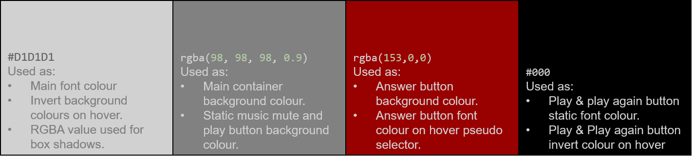

# [**Survive**](https://joelmichaelrutter.github.io/survive-web-MS2/index.html)
## **Milestone Project 2**
### **General Purpose & Introduction**
Survive is a fun and interactive personality quiz. The premise of the quiz enables to see how they would fare in a zombie apocalypse. Upon starting the game, the user is presented with a finite number of scenarios, questions, and options inside a robust and responsive UI which they must read and navigate through. Once they have completed the quiz, the user is presented with a score which relates them to a popular culture zombie content character.

Based on the topical content of the quiz, I thought it was really important to generate a creepy, post-apocalyptic and uneasy atmosphere. I will explain my user considerations, stories and how I met the user stories inside this document.  
## Table of Contents
* ### [Deployed Site](#deployed-website)
* ### [Demo](#site-demonstration)
* ### [UX](#user-experience)
* ### [Design](#design-features)
* ### [Features](#functional-features)
* ### [Technologies](#technologies-used)
* ### [Testing](#application-testing)
* ### [Deployment](#deploying-the-site)
* ### [Reflection](#project-reflection)
* ### [Further Development](#further-development-scope)
* ### [Credits](#project-credits)
* ### [Acknowledgement](#project-acknowledgements)
# [**Deployed Website**](https://joelmichaelrutter.github.io/survive-web-MS2/index.html)
By clicking the hyperlinked header above, you can access the final deployed site hosted on GitHub Pages.
# <a id="site-demonstration"> **Site Demonstration**
## [Am I Responsive?](http://ami.responsivedesign.is/)
Below you can see an image of the final site in the Am I Responsive tool which shows the fantastic level of responsivity of the site to a number of viewports. Attached the above header is a link to the Am I Responsive tool; should you wish to use it yourself.  

# **User Experience**
In this section, I will discuss the user experience considerations I implemented during the development process.
## **Strategy**
### **Business Goals**
In terms of business scope, there are certainly less goals, compared to my previous project, as I didn’t design this application to serve as a business. The main goals that I wanted to achieve are as follows:
* To provide the user with a fun, interactive zombie-themed personality quiz experience.
* To generate an uneasy and spooky atmosphere to put the user in the correct frame of mind to answer the questions.
* To provide a seamless and easy user journey through consistent, robust and responsive UI design.
* To ensure ease of learning to allow users to use the application well without using it previously.
* To provide an informal gimmick like response to the user so that the quiz, whilst atmospheric is not too serious to put off a wider audience.
### **User Stories**
Below are the user stories that needed to be fulfilled for the project to be successful from the perspective of the user:
* To discover Survive and instantly be able to understand the purpose of the site.
* To be able to navigate through the site with ease on the first visit.
* To understand and buy into the atmosphere the quiz promotes.
* To be able to control all elements of the application easily, including any background audio should the user not wish to hear it.
* To see their score increase as the quiz progresses.
* To be provided with feedback on how they performed.
* To be able to play again.
## **Structure Plane**
Due to the scope of the project (increasing from my last one) I needed to incorporate more technologies, I wanted to create something simple and robust, as well as entertaining, unique and interactive. 

For this reason, I decided to keep my HTML to one page and modify it with JavaScript. I adopted a mobile-first approach which made making things responsive much easier than my first project where I primarily designed for desktop first.  
With one of the main goals and user stories being to create a creepy atmosphere, I thought about how to achieve that. My conclusion to the matter was imagery, audio and consistent colour usage to create a seamless UI. I will explain exactly how I created the atmosphere of the site and the tools later in the document. In terms of the quiz itself, I knew that I wanted it to be robust and responsive, so I went with a classic game show style container set with a main container, and four multiple choice answers below it.  

I determined that a classic navigation bar was not required - due to the specific nature of the site’s purpose. As the app is essentially a personality quiz with the premise of “what would you do in the zombie apocalypse?”, I decided that I didn’t want the questions to be timed like you would have, for example, on a general knowledge quiz and I also wanted each user to have a consistent journey so the questions and situations are in a specific order.  

## **Skeleton Plane**
I employed one stage to the skeleton process. Due to the nature of the site, I used a different approach to my first project and digitally wireframed the site to begin with. To provide myself with a fuller picture and a plan to lean on, I took the skeleton phase of my project a little further by designing some of the written content that would be implemented into the project.  

Below you will find links to images of my plan for the site. It is worth noting that this was the original development plan and that some features may differ slightly either in context or position due to the site evolving through the development process.  

* [UI Wireframes](assets/images/read-me-images/survive-wireframes.png)
* [Question Logic & Initial Function Plan](assets/images/read-me-images/survive-logic-and-function-plan.png)
* [Feedback Container Plan](assets/images/read-me-images/survive-user-feedback-container-plan.png)  
# **Design Features**
## **Imagery**

To begin my development process, I asked myself what would be one of the main ways that I could generate a spooky atmosphere for the user as they interacted with the quiz. The first thing that came to me is via imagery, so I located an appropriate background image for my site.  
I downloaded the background image from Shutterstock, a link to the image and references to the creator can be found via this [link]( https://www.shutterstock.com/image-photo/crowd-hungry-zombies-woods-silhouettes-scary-504847591).  
The misty, pastel tone of the image was perfect for portraying a dark, horror atmosphere, and the zombie silhouettes were perfect. I wanted to keep gore out of scope for the site so that it could appeal to younger users as well as older too.
## **Audio**
The second consideration I made to effectively generate an atmosphere for the user was to include some background audio which would play when the user starts the game. I have made user considerations in terms of the audio and the user has full control over when the audio plays and when they would like to mute it, despite there being no visible HTML controls on the page. 

I will explain these functions in the functional features section of this document.   
To create my background audio, I downloaded some stock royalty free music & sound effects from [Fesliyan Studios]( https://www.fesliyanstudios.com/).   
The sounds I downloaded are as follows:  
* [Dark Fog – Background Music]( https://www.fesliyanstudios.com/royalty-free-music/download/dark-fog/265)
* [Zombie & Gunfire Soundeffects]( https://www.fesliyanstudios.com/sound-effects-search.php?q=)  

I mixed the sound effects and music together using [Spotify Sound Trap]( https://www.soundtrap.com/home).  
## **Colour Choices**
The colours I sourced for the project were mostly developed by extracting the HEX values from parts of the background image by using [HTML Color Codes]( https://html-color-codes.info/colors-from-image/) colour from image tool. The reason that I adopted this approach was to create a visual connection with the background depicting some zombies amongst the trees and the main content in the foreground of the page, therein adding to the atmosphere that the image generates.  
The colour palette for the whole project and the uses of those colours is set out below:  

## Typography
For the project, I used two fonts imported into my CSS file from [Google Fonts](https://fonts.google.com/). They were selected in line with the overarching themes that I wanted to achieve. The fonts I chose, examples and explanations are detailed below:  
### **DotGothic16**
  
I chose DotGothic16 after auditioning other fonts as it adds to the atmosphere of the quiz/game. It’s degraded and blocky nature have a post-apocalyptic yet fun/8bit feel, both of which are attributes that I strived to achieve in business and user goals.  
### **Roboto**
  
Roboto was one of the pairings that Google fonts recommended with DotGothic16. I liked the clear cut nature of the font and decided it was best for the purpose of development so that the user would be able to clearly read the situations and questions to play the quiz.
## **Iconography**
For iconography, I imported an icon library from [Font Awesome]( https://fontawesome.com/). In particular, I used the following icons:  
* [Play Icon](https://fontawesome.com/v5.15/icons/play?style=solid) - This icon is used inside the play music button.
* [Mute Icon](https://fontawesome.com/v5.15/icons/volume-mute?style=solid) - This icon is used inside the mute music button.
* [Music Icon](https://fontawesome.com/v5.15/icons/music?style=solid) - This icon is used inside both play music and mute music buttons.
* [Biohazard Icon](https://fontawesome.com/v5.15/icons/undo-alt?style=solid) - This icon is used in the play button.
* [Back Circular Arrow](https://fontawesome.com/v5.15/icons/undo-alt?style=solid) - This icon is used in the play again buttons.  
# **Functional Features**
Below I will list the functional features of the site in order, how I have manipulated the features with JavaScript to make the site interactive and how the features satisfy my user stories:  
* **Main Header** - The main header of the page displays the title of the application ‘Survive’. This immediately allows the user to discover the game which satisfies the first user story. The heading text is wrapping in an  tag which links to index.html. An appropriate aria-label has been added for accessibility purposes. Clicking or tapping the heading will reload the index.html file as is common practice with most web pages.
* **Play & Mute Music Buttons** - These buttons allow the user to control the playing and pausing of audio at any point during the quiz. They have a hover pseudo selector active on nearly all devices to provide visual feedback to the user as to what they are doing. The buttons are container in a flex container and justified to spread out via justify-content: space-around which makes the site very easy to make responsive.
* **Rules Container** - This div displays some introductory text and is displayed in the centre of the screen so that the user can locate it easily, its content provides an introduction to Survive and explains the premise of the game. Within the rules container there are additional elements:
  * **Rules List** - This list provides more specific guidance to the user on how the game works and the scoring system.
  * **Start Game Button** - The button is positioned at the bottom of the rules container. I have styled this to be appealing to the user and entices them to click. There is a pseudo selector applied on larger screen devices to provide visual feedback to the user as to what they are doing. All this combined makes the site easy to navigate, even for someone with no exposure previously. The button has some JavaScript functionality attached to it which I will explain below:
    1.	When the user clicks or touches the button, the startGame function is called. This function does a number of things. Firstly, it removes the rules container from the DOM by adding a CSS declaration of display: none; to it, whilst simultaneously changing the display: none; properties of the game area and the answer container so that they appear.
    2. It also calls the function changeQuestionAndOptions which populates the game area and answer buttons from the question array in questions.js.
    3.	Finally, the function calls the audio.play method attached to my audio object which contains the background music. The user can mute(pause) this music by clicking the mute button and subsequently play the music by clicking the play button when the music is in a paused state.  
* **Game Container** - The game area contains a few subsections:
  * **Score Block** - This div contains a h2 element containing the content “score:0”. The number is wrapped in a span tag and labelled with the ID “score-tally-container”. This id is recognised in my script.js file and passed as an integer to the variable scoreTally. This integer is then operated on in the tallyScore function which adds a value of 40, 30, 20 or 10 to the scoreTally variable depending on which button the user selects. At the end of the tallyScore, every time it is called when a user selects an answer, the scoreTally variable is then passed back into the container creating a running total score. This enables the user to see exactly what score they have as they progress. In terms of styling, I pulled a grey from the background image and added a box shadow with the RGBA value of the main font colour to help the two blend together. I did this to further elevate the creepy atmosphere of the game to the user.
  * **Number Container** - Beneath the score, there are three spans, the first of which is labelled with an ID “number-container”. It is assigned to the variable “numb” in the changeQuestionAndOptions function. The text content of this span is populated from the questions array from questions.js via the changeQuestionAndOptions function. One additional caveat to add here is that inside the function, the question number is assessed inside the changeQuestionAndOptions function and when it reaches the blank object at the end of the array (currently checked for question 11), it calls the assessScore function. The assess score function checks the value of the scoreTally variable and displays the relevant score feedback.
  * **Situation Container** - This span element is labelled with the id “situation-container”. This is recognised in the changeQuestionAndOptions function and allocated to the variable “situ”. The text content of this variable is then set by the changeQuestionsAndOptions function from the questions array. In the array, there are objects nested as each element. Through dot notation, the variable accesses the array and the relevant key to access the string text content within and then sets the text content.
  * **Question Container** - This span is also populated from the questions array of objects in the questions.js file via the changeQuestionAndOptions function inside script.js. The span is assigned to the “quest” variable inside the function. The array and subsequent objects are accessed via dot notation and passed into the variable which then sets the text of the HTML via the .textContent method. This happens each time the function is called when the user clicks one of the answer buttons.
* **Answer Button Container** - This div is a flex container and contains the buttons that the user uses to play the game. Depending on the viewport width, the flex container works slightly differently, for smaller screen widths, the container wraps its contents onto a new line creating a layout with more verticality. The responsive nature of CSS flexbox makes a robust and widely responsive layout.
* **Answer Buttons** - These HTML button elements are the user’s main point of interaction with the game. Whilst limited in terms of the scope, the layout, positioning, and styling of the buttons promotes my business goals and user stories by making the site easy to navigate and pick up. The button functionality tie in to two functions within the script.js file:
  1. **changeQuestionsAndOptions()** – This function is called whenever the user clicks an answer button. It amends the text content in the game container (excluding the score-block) and the spans within the answer buttons, populating from the nested data questions.js file.
  2. **tallyScore()** – This assesses which answer button is clicked based on the id value of the element and adds an integer to the scoreTally variable before setting the textContent of the scoreTally variable again to update the score.  

In terms of styling, I decided to colour the text with the main text colour that I pulled from the background image and have the background colour as a deep crimson to signify separation from the background and to signal to the user that these buttons were the interactive part of the site. Depending on the viewport width, there are pseudo selectors applied which reverse the colour and adds a box shadow either on hover or on press of the button to provide visual feedback to the user as to which answer button they are selecting.

* **Score Containers** - These divs are revealed based on the value of the scoreTally variable which is assessed in the tallyScore function. The divs are styled in the same manner as the rules container for visual consistency and contain feedback for the user as to how they scored on the quiz. It relates the score to a character in zombie popular culture. There are four divs in total:
  * **Best Score** - This div’s CSS display declaration is changed in the assessScore function to block if the scoreTally value is greater than 300. Its content informs the user that they have achieved a great score in terms of their survival chances and relates them to Rick Grimes (image is also provided), the main protagonist and survival machine from the Walking Dead franchise.
  * **Good Score** - This div’s CSS display declaration is changed in the assessScore function to block if the scoreTally value is greater than 200. Its content informs the user that they have achieved a good score in terms of their survival chances and them to Shaun (image is also provided), the main protagonist from the cult favourite, Shaun of the Dead.
  * **Bad Score** - This div’s CSS display declaration is changed in the assessScore function to block if the scoreTally value is greater than 100. Its content informs the user that they have achieved a bad score and relates tshem to David (image is also provided), a heavily disliked character from Shaun of the Dead (who does end up getting eaten by zombies).
  * **Worst Score** - This div’s CSS display declaration is changed in the assessScore function to block if the scoreTally value is equal to 100 (which is the lowest possible score a user could achieve). Its content informs the user that they have achieved the worst score in terms of their survival chances and relates them to (you guessed it!) a zombie (image is also provided).
  * **Play again button** - The final piece of functionality in the site  is the play again button which is positioned in a very similar position to play button at the start of the game, the styling for the buttons are the same in terms of colour; however, I used a more appropriate undo arrow icon to suggest to the user that this was to srestart the game. The same hover and active pseudo selectors are applied to the element to invert the colours of the button as the user interacts with it to provide visual feedback. The JavaScript functionality attached to this button is as follows. On click or press, the button calls the restartGame function. This function reloads the window placing the user back at the rules container to begin again. This functionality satisfies the final user story in allowing the user to play the game again.  

In summary, the premise and topic of the game create the fun element. It’s a commonly debated topic “what would you do during the zombie apocalypse?”. This element combined with the background image and music as well as the textual situations provided promotes the uneasy and creepy atmosphere to the user. The interactivity of the site comes through in the buttons different paths the user can take based on their personality which is formed with the functionality in the script.js file.
# **Technologies Used**
Below I will list the variety of technology I used during the development process:
### **Operating Systems**
* **[Windows 10](https://www.microsoft.com/en-gb/windows/get-windows-10)**
### **GitPod** - was used as an Integrated Development Environment.  
### **Languages**
* **[HTML5](https://en.wikipedia.org/wiki/HTML5)**
* **[CSS3](https://en.wikipedia.org/wiki/CSS)** - Flexbox
* **[JavaScript](https://en.wikipedia.org/wiki/JavaScript)** - ES6 Syntax 
### **Frameworks**
* **[Google Fonts](https://fonts.google.com/)** - for typography
* **[Font Awesome](https://fontawesome.com/)** - for iconography  
### **Version Contol**
* **[Git](https://en.wikipedia.org/wiki/Git)** - was used as a version control system.
* **[GitHub](https://en.wikipedia.org/wiki/GitHub)** - was used as a code repository and deployment platform.  
### **Wireframes**
* **[Microsoft Visio](https://en.wikipedia.org/wiki/Microsoft_Visio)** - Was used to plan the content, functionality of the site and to create the front end wireframes.  
### **Other**
* **[Can I Use?](https://caniuse.com/)** - To understand browser compatibility and help with testing.
* **[Online Image Resizer](https://resizeimage.net/)** - For reducing image size in terms of resolution and compression.
* **[Microsoft Word](https://en.wikipedia.org/wiki/Microsoft_Word)** - Used to write the initial README and TESTING documents. 
* **[Microsoft Powerpoint]( https://en.wikipedia.org/wiki/Microsoft_PowerPoint)** - To crop and resize my images for the score containers, and create images for this README.md file.
* **[Microsoft Forms](https://forms.microsoft.com/)** - To create my user testing feedback form.
* **[Microsoft Excel](https://en.wikipedia.org/wiki/Microsoft_Excel)** - To create my manual testing spreadsheet checklist.
# **Application Testing**  
Please click [here](testing.md) to see a full breakdown of all testing completed on the application.
# **Deploying the site**
The finalised version of the site is deployed on GitHub Pages. Here are the steps I followed to deploy the site:
1.	Login to [GitHub](https://github.com/) and locate the [survive-web-MS2](https://github.com/JoelMichaelRutter/survive-web-MS2) repository.
2.	In the top menu of the repository, select the settings option.  

3.	Scroll down the settings page until you find the GitHub Pages option and click it.  

4.	On the GitHub pages section, locate the dropdown that displays the word “None”. Click the dropdown and select the “Master” or “Main” branch.  

5.	The page will refresh automatically and provide a link to the deployed site in the uppermost section. Click this link to load the deployed site.  

6.	If the site does not display straight away, it may be because GitHub pages is preparing the site, wait for a few minutes and follow the previous step again.  
## **Forking the repository**
Should you wish to use the site code inside the repository without affecting the original repository, you can make a fork and create a copy of the repository which you can view and amend the code within. To create a fork, follow these steps:
1. Login to [GitHub](https://github.com/) and locate the [survive-web-MS2](https://github.com/JoelMichaelRutter/survive-web-MS2) repository.
2. In the top right-hand corner of the repository, you will see three buttons just below your profile icon. The rightmost button is called “fork”. Click this button.  

3. The repository will now be copied to your own GitHub account.  
## **Cloning the repository**
You can create a clone of the repository inside your development environment. To do this, follow these steps:
1. Login to [GitHub](https://github.com/) and locate the [survive-web-MS2](https://github.com/JoelMichaelRutter/survive-web-MS2) repository.
2. Whilst in the repository, you will see the various files contained within. Above this list, you will see a button labelled “code”. The button will have a small download icon beside it.  

3.	When you click this icon, a small dropdown will open. Inside the dropdown will be the URL for the deployed site. Copy this URL by clicking the clipboard icon.  

4.	Open the Git Pod integrated development environment. 
5.	Whilst in the development environment, navigate to the bash terminal.
6.	In the bash terminal, enter “git clone”, then paste in the URL copied from the GitHub repository and hit enter.

7.	A clone of all files will now be pulled into the workspace.  
# **Project Reflection**  
Wow. What a learning curve.  At times, this project nearly broke me. But after persevering and with the excellent support of code institute, I am really proud of what I have built. I set out not to create the flashiest application but something that was robust and worked whilst championing the adage of clean code. I’ve enjoyed watching my idea materialise into something tangible, from the blocky basic styles and functionality into a well styled and functionality zombie themed personality quiz. Whilst adjusting to my first real programming language has been tough, I think over the course of the project, the concepts that have been taught have really sunk in. There is a lot more to learn in terms of JavaScript, and I can’t wait for the day that I am truly fluent in the language. I know that there is lots more to come, bring it on.  
# **Further Development Scope**  
In my own humble opinion, I have left this application with lots of future scope for development. I have commented all of my code heavily with detailed explanations in each of my code files as to exactly how the code blocks work and the considerations that future developers would need to make if adding to the application. This doesn’t just apply for the script.js or questions.js file, it is project wide. In terms of my own ideas as to how this application could be developed further:  
* **Additional Questions** – Adding additional questions to create a longer experience would be easy to do considering I have left a template and an explanatory comment to developers as to how to add elements into the questions array.
* **Randomisation** – Whilst the randomisation of the questions and the order that they appear in the answer buttons was of no consequence as the quiz is a personality quiz and designed to go in order as the user progresses through the fictional zombie apocalypse, some layout randomisation would be great in future so that the order in which the buttons appear could add to the playability. 
* **Branching** – It would be excellent if the quiz could evolve more dynamically to the users answers where if the user selects a bad answer, the next situation leaves them in a more difficult situation where they have to pick a better answer otherwise the game could end. With that kind of functionality, you could almost turn the game into a fully blown text based role playing game which could update with new scenarios as development continued.
# **Project Credits**
## **Code**
* **[Code Institute’s Full Stack Software Development Course](https://codeinstitute.net/)** - For their course modules so that I could skip back and review course content to help me.
* **[Stack Overflow Community](https://stackoverflow.com/)** - For helping me find my way around problems and suggesting fixes.
* **[W3 Schools](https://www.w3schools.com/)** - For serving as a quick dictionary of declarations and values.
# **Project Acknowledgements**
* **Code Institute Tutor Support** - For pushing me in the right direction with tricky bugs, I would specifically like to mention Sean and Scott who were sensational.
* **My Partner** - Charlotte Howard for believing in me and helping me write content that wasn’t absolutely rubbish.
* **My Mentor** - Chris Quinn for believing in me, generally being a coding god and helping me keep the demons at bay.