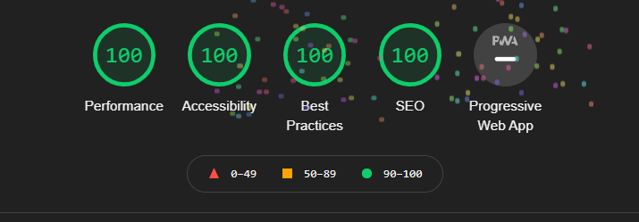

# **Survive Web Application Testing Document**
## **Issues During the Development Process**
In all honesty, I didn’t come across too many issues in the development process. It was just a case of functions not working due to missing variables or incorrect syntax. As this project was smaller in scope but larger in terms of skillset, it was less time consuming. The only significant issue I can think of during the development process was getting the background music to play as during my first attempt at solving the problem, I was using a HTML audio element as opposed to a JS object. I was going to resign myself to just having the audio controls at the top of page despite its unsightly appearance, but after speaking with tutor support, I managed to realise my vision in terms of the background music in its entirety.  
# **Issues During the Testing Process**
I planned to build this application with a mobile first approach so I spent probably around 70% of my development time in DevTools in the iPhone 5 emulation. I thought it was necessary to use such a small device as the viewport real estate is extremely valuable. If I could get everything responding nicely on that viewport size, the rest of the layout and styling would be easy to expand.  
In developing in this approach, I overlooked one thing. I planned to have some pseudo selectors on hover to provide visual feedback to my user as to what they were doing. The issue this presented for mobile and touch devices was that as the buttons weren’t disappearing or a new page loading following a touch, the hover pseudo selector was remaining active. This presented a bit of a UX issue as the hover pseudo selector could entice a user to select an answer that they didn’t want to because it would be highlighted as soon as the question loaded. To combat the problem, I removed the hover pseudo selector from the mobile and tablet media queries so that it would not be active. One caveat to add here is that tablets in landscape view trigger my small laptop media query (1024px. So whilst the pseudo selector was not applied in tablet portrait view, it was in landscape. I thought about two fixes to this problem:

  1.	I firstly envisaged using ontouchstart and ontouchend to run some functions to change the CSS applied to the element and revert when the touch ended to provide the visual feedback entitled to mouse users. After weighing this up and researching the method, I determined that because of touch events patchy support on Safari and its taxing load on performance, the best and most time effective option in terms of development would be what follows.
  2.	I added an additional media query to service the norm of laptop sizes (from 1280px and above). I added the hover pseudo selector into this media query so that laptops and desktop user can still have the benefit of their visual feedback. Inside the tablet and mobile media queries, I added the same class but replaced the pseudo selector with :active. This way whilst the effect is diminished somewhat by its own nature, the user still has some colour inversion above the usual browser built in blue flash. 

# **Known Issues**
The only issue with the site persists from the problem I menitoned above. On professional tablets such as the iPad pro, the screen resolution will trigger the laptop media query and the hover ppseudo selector will stay active. This could be solved using on start and touch end, but it is quite taxing to performance.
# **Functionality and Compatibility Testing**
To test the site, I employed a manual testing checklist in excel where I tested the site display and functionality element by element. Please click [here](assets/testing-files/survive-manual-testing-checklist.xlsx) to access the spreadsheet checklists for full details of all manual functionality and compatibility testing completed across a range of devices (Please note, you will need to download the excel file to access it). To summarise the manual testing, the website has been tested by myself in both portrait and landscape mode (where appliable) on the following devices, browsers & operating systems:
   * Google Pixel 3 – Google Chrome, MS Edge, Firefox – Android 11
   * iPhone 6 Plus – Safari 12 – iOS 12.5.4
   * iPad 6th Gen - Safari 14, Google Chrome, Firefox Daylight, MS Edge - iOS 14.4
   * HP Elitebook – Google Chrome, Firefox, MS Edge & Windows 10
   * AOC Desktop Monitor – Google Chrome, Firefox, MS Edge – Windows 10.  

The site has also been tested inside Google Chrome dev tools and is fully responsive to all device sizes. In conclusion, the website is:
   * Cross compatible across device sizes as demonstrated through manual testing and in dev tools. 
   * Cross compatible across a large proportion of popular browsers as demonstrated through manual testing.
   * Cross compatible across operating systems as demonstrated by manual testing.  

In addition, I have also completed some limited user testing, the feedback can be found [here](assets/testing-files/survive-web-user-testing.xlsx). Like before, to access this spreadsheet, you will need to download the file.
# **Performance Testing**
To test the performance of the website, I used Google Lighthouse inside Chrome Dev Tools. Below I will outline the applications performance via the metrics provided by Google Lighthouse:

* **Index.html**  

# **Code Validation**
I have validated all code files through the following means:
* **index.html** - Validated through the [w3schools HTML validator](https://validator.w3.org/#validate_by_input) via direct input. No errors or warnings present.
* **styles.css** - Validated through the [w3schools Jigsaw CSS Validator](https://jigsaw.w3.org/css-validator/validator) via direct input. No errors or warning present.
* **script.js** - Validated through [JShint](https://jshint.com/). No errors present, however there are insignificant warnings due to my use of ES6 syntax.
* **questions.js** - Validated through [JShint](https://jshint.com/). No errors present, hoever there are warnings due to my use of ES6 syntax and due to an unread variable (this warning is being thrown as the variable is not read in the same file but exported to the script.js file).